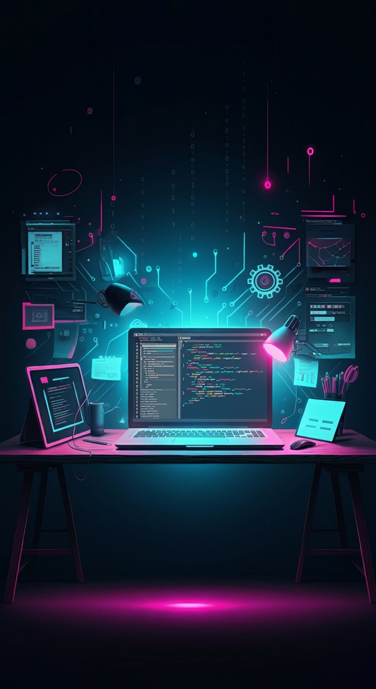

  <h1>👋 Hi, I'm Anthony Kamau</h1>
  <h3>Software Engineer in the Making</h3>
  
  

---

## 🚀 My Journey  

It all began with a simple question: *"How does the internet know what I'm searching for?"* That curiosity ignited my passion for technology. My first line of code - `print("Hello, World!")` - was the spark that started everything.  

Today, I'm actively developing my skills to transition from asking how things work to building systems that solve real problems. Every day brings new opportunities to:  
- 🧩 **Break down complex systems** into understandable components  
- 💻 **Write clean, efficient code** that makes a difference  
- 🤝 **Collaborate with others** to create meaningful solutions  

---

## 🛠️ Technical Skills  

### 💻 Core Languages
Python · JavaScript · HTML/CSS  

### 🧰 Tools & Frameworks

  

 

### 📚 Currently Learning
React · Node.js · API Design  

---

## 📈 Current Projects  

- 🔧 **Automated Task Management System** — *Building an automated task management system*  
- 🌐 **Personal Knowledge Base Application** — *Developing a personal knowledge base application*  
- 📊 **Data Visualization Tools** — *Creating data visualization tools*  

> 💡 *(Project details coming soon as I progress in my learning journey)*  

---

## 📫 Let's Connect  

I'm always interested in:  
- Collaborating on meaningful projects  
- Discussing system design concepts  
- Learning from experienced developers  

   
  ✨ <em>The best way to predict the future is to code it.</em> ✨

